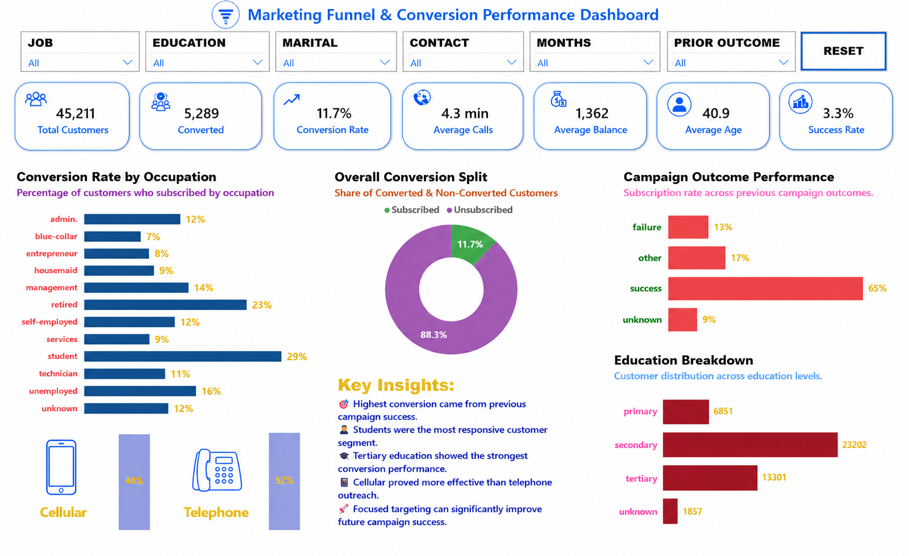

# 📊 Marketing Funnel & Conversion Performance Analysis

An interactive **Power BI Dashboard** developed as **Task 3** for the **Future Interns – Data Science & Analytics Internship (2026)**.

This project analyzes customer conversion performance using the **Bank Marketing Dataset** to identify conversion trends, campaign effectiveness, customer behavior, and actionable business recommendations.

---

# 🎯 Project Objective

This dashboard helps answer key business questions such as:

- Where are customers dropping off in the marketing funnel?
- Which customer segments have the highest conversion rates?
- Which campaign outcomes perform best?
- Which contact method is more effective?
- How can future marketing campaigns improve conversions?

---

# 🛠️ Tools Used

- Microsoft Power BI
- Power Query
- DAX
- Data Modeling
- Data Visualization

---

# 📂 Dataset

**Bank Marketing Dataset (UCI Machine Learning Repository)**

The dataset contains customer demographic information, campaign details, previous marketing outcomes, and subscription status used to evaluate marketing performance.

---

# 📈 Dashboard Features

### 🎛 Interactive Filters

- Job
- Education
- Marital Status
- Contact Method
- Campaign Duration (Months)
- Previous Campaign Outcome

### 📊 KPI Cards

- Total Customers
- Converted Customers
- Conversion Rate
- Average Calls
- Average Balance
- Average Age
- Success Rate

### 📉 Visualizations

- Conversion Rate by Occupation
- Overall Conversion Split
- Campaign Outcome Performance
- Education Breakdown
- Contact Method Comparison
- Key Business Insights

---

# 💡 Key Insights

- Customers with previous campaign success achieved the highest conversion rate.
- Students recorded the strongest conversion performance among occupations.
- Customers with tertiary education converted more frequently.
- Cellular campaigns performed better than telephone campaigns.
- The majority of customers did not subscribe, highlighting significant funnel drop-off opportunities.

---

# 🚀 Business Recommendations

- Prioritize customers with previous successful campaign history.
- Increase focus on high-converting customer segments.
- Expand cellular-based marketing campaigns.
- Optimize strategies for low-converting occupations.
- Implement targeted follow-up campaigns to improve overall conversion rates.

---

# 📸 Dashboard Preview

---

# 📁 Repository Contents

- FUTURE INTERNS TASK3.pbix
- future interns task3 img.png
- README.md

---

# 🎯 Skills Demonstrated

- Marketing Funnel Analysis
- Conversion Analysis
- KPI Development
- Interactive Dashboard Design
- Business Intelligence
- Data Visualization
- Business Insight Generation

---

## 👩‍💻 Author

**Goli Akshaya**

Final Year B.Tech (Computer Science & Engineering)

Aspiring Data Analyst

---

⭐ **If you found this project useful, consider giving it a Star!**
